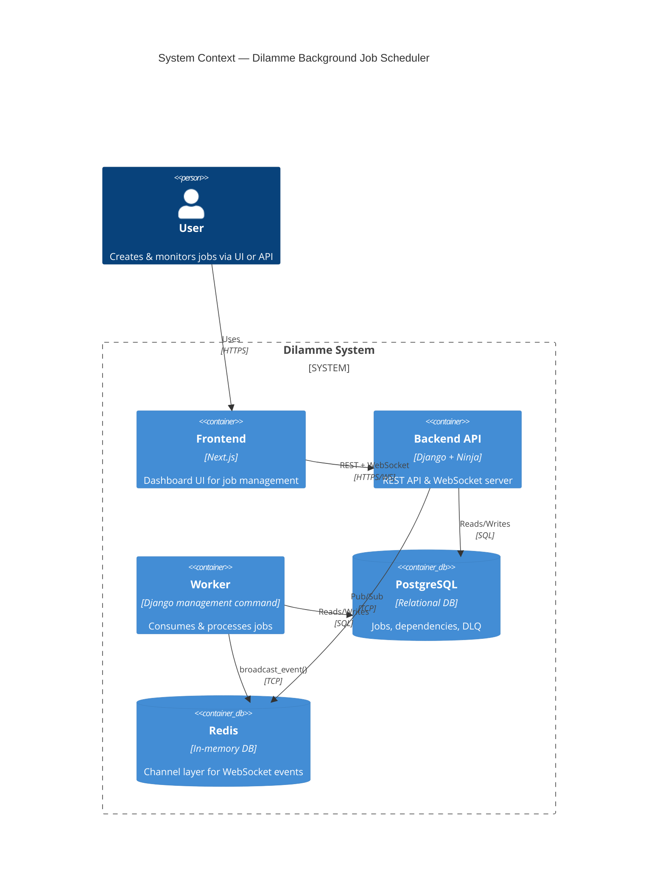
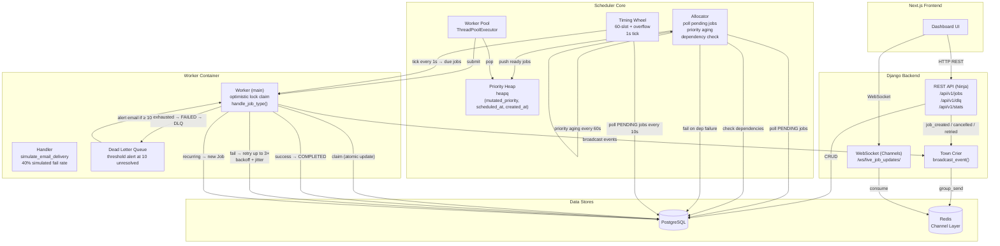
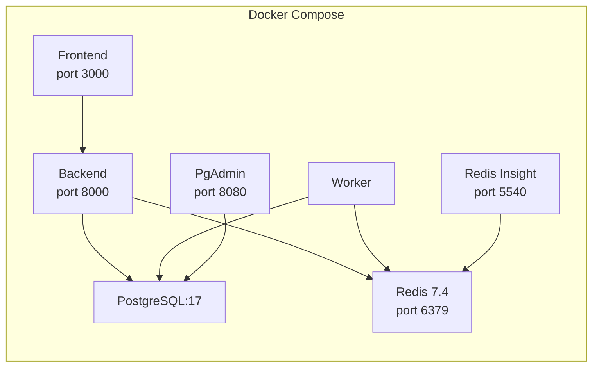

# Dilamme Background Job Scheduler

## Overview

Dilamme is a background job scheduler that polls the database for pending jobs, uses a **Timing Wheel** algorithm for time-based scheduling and a **Priority Heap** for priority-based dispatch, then assigns tasks to workers for processing. It supports **job dependencies**, **recurring intervals**, **priority aging** (anti-starvation), **exponential backoff retries**, and a **Dead Letter Queue** with threshold alerts. Real-time job events are broadcast over WebSocket via Redis.

---

## System Context



---

## Container Architecture & Scheduling Pipeline



---

## API Endpoints

| Method | Path | Description |
|--------|------|-------------|
| `POST` | `/api/v1/jobs` | Create a job (with priority, schedule, interval, dependencies) |
| `GET` | `/api/v1/jobs` | List jobs (paginated, filterable by status) |
| `GET` | `/api/v1/jobs/{id}` | Get a single job |
| `PATCH` | `/api/v1/jobs/{id}/cancel` | Request job cancellation |
| `GET` | `/api/v1/dlq` | List Dead Letter Queue entries |
| `PUT` | `/api/v1/dlq/{id}/retry` | Retry a failed job from DLQ |
| `GET` | `/api/v1/stats` | Aggregate counts (total, pending, processing, completed, failed, cancelled, dlq) |
| `WS` | `ws:///ws/live_job_updates/` | Real-time job event stream |

### WebSocket Events

`job_created`, `job_processing`, `job_completed`, `job_failed`, `job_failed_and_retried`, `job_cancelled`, `job_resolved`, `job_retried`

---

## Data Model

```mermaid
erDiagram
    Job {
        uuid id PK
        string type
        int priority
        int mutated_priority
        json payload
        string status "pending|processing|completed|failed|cancelled"
        datetime scheduled_at
        int retry_count
        datetime processed_at
        string interval "NULL | every_1_minute | every_5_minutes | every_1_hour"
        bool is_cancel_requested
        datetime created_at
        datetime updated_at
    }
    JobDependency {
        uuid id PK
        fk parent_job "must complete first"
        fk child_job "waits for parent"
    }
    DeadLetterQueue {
        uuid id PK
        fk job
        text error
        datetime failed_at
        bool resolved
    }

    Job ||--o{ JobDependency : "as_parent"
    Job ||--o{ JobDependency : "as_child"
    Job ||--o| DeadLetterQueue : ""
```

---

## Key Design Decisions

### 1. Two Parallel Scheduling Paths

| Path | Purpose | Mechanism |
|------|---------|-----------|
| **Allocator + Heap** | Immediate/short-delay dispatch | Polls DB every 1s, applies priority aging, checks dependencies, pushes to `heapq` |
| **Timing Wheel** | Future-dated dispatch | 60-slot circular buffer + overflow list, ticks every 1s, refreshes from DB every 10s |

The allocator and timing wheel both run in the **worker container** (via `manage.py run_workers`). Both submit jobs to the same `ThreadPoolExecutor`.

### 2. Priority Aging (Starvation Prevention)

Every 60 seconds a job sits in PENDING state, its `mutated_priority` decreases by 1 (lower number = higher priority). This prevents low-priority jobs from being indefinitely starved.

### 3. Optimistic Locking

Workers claim a job via an atomic DB update: `WHERE status=PENDING` → `SET status=PROCESSING`. If the update affects 0 rows, another worker already claimed it. No distributed lock needed.

### 4. Retry with Jittered Exponential Backoff

| Attempt | Base Delay | Actual (with ±20% jitter) |
|---------|-----------|---------------------------|
| 1 | 1s | ~0.8–1.2s |
| 2 | 5s × 2² | ~16–24s |
| 3 | 25s × 2³ | ~160–240s |

After 3 failures, the job goes to the **Dead Letter Queue**. If the DLQ has ≥ 10 unresolved entries, an alert email is triggered.

### 5. Dependency Resolution

Job dependencies are modeled as a M2M through `JobDependency`. The allocator checks: all parents must be COMPLETED; if any parent is FAILED, the child is immediately failed and pushed to DLQ.

### 6. Recurring Jobs

When a job with `interval` field completes, a new `Job` is created with `scheduled_at = now + interval_duration`.

---

## Deployment



| Service | Image | Purpose |
|---------|-------|---------|
| `postgres` | postgres:17 | Primary database |
| `pgadmin_web` | dpage/pgadmin4 | DB administration UI (port 8080) |
| `redis` | redis:7.4-alpine | Channel layer for WebSocket (port 6379) |
| `redis-insight` | redis/redisinsight | Redis admin UI (port 5540) |
| `backend` | custom Dockerfile | Django dev server (port 8000); runs REST API + WebSocket |
| `worker` | custom Dockerfile | `python manage.py run_workers`; runs allocator, timing wheel, and worker pool |
| `frontend` | custom Dockerfile | Next.js dev server (port 3000) |

A production variant (`docker-compose.prod.yml`) is also available.
